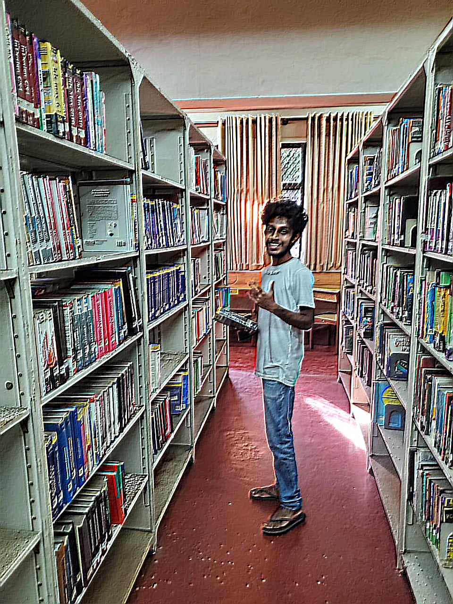
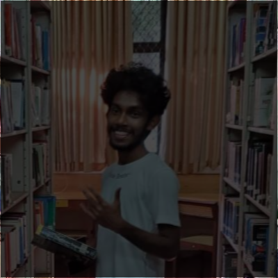
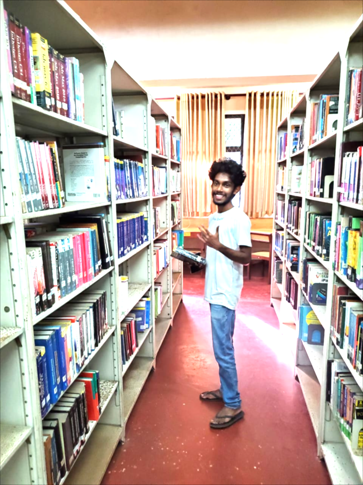
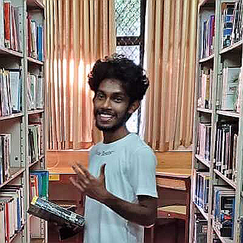

# PixelBlend 🎨🖼️

PixelBlend is a **Java-based image filtering application** that allows users to enhance and modify their photos using a variety of filters.
## Features 🚀
- Apply various image filters:
  - 🏴 Grayscale
  - 🌟 Brightness Adjustment
  - 📦 Box Blur
  - 🌫️ Gaussian Blur
  - 🎭 Motion Blur
  - 🖌️ Emboss
  - 🔪 Sharpen
  - 🔍 Laplacian Edge Detection
- **Undo & Redo** applied filters 🔄
- **Add Multiple filters to one image**
- **Command-Line Interface (CLI)** support 💻
- **Web Interface (Coming Soon) 🌐**


---

## Getting Started 🛠️

### Clone the Repository 📥
```bash
 https://github.com/code-GDC/PixelBlend.git
 cd PixelBlend
```

### Build & Run 🚀
Use Gradle to build the project and run the application:
```bash
 gradlew build 
 java -jar build/libs/PixelBlend.jar
```
Or run the main file in IntelliJ IDEA:
```bash
 Open the project in IntelliJ
 Navigate to `Main.java`
 Click ▶️ Run
```

---

## Example Run 📸
```bash
Enter image path: photo.png
Image Loaded Successfully
Width: 360
Height: 360
Choose an option:
1. Apply Grayscale Filter
2. Apply Brightness Filter
3. Apply Box Blur Filter
4. Apply Gaussian Blur Filter
5. Apply Motion Blur Filter
6. Apply Emboss Filter
7. Apply Sharpen Filter
8. Apply Laplacian Filter
9. Undo
10. Redo
11. Save 
12. Save and Exit
```

Applying a Brightness Filter:
```bash
2
- Enter brightness percentage -
300
Filter Applied.
```

Saving the image:
```bash
12
Image saved as new_photo.png
```

---

## Screenshots 📷
Here are some screenshots showcasing the application's functionality:

### Grayscale Filter
<p align="center">
  
  
</p>

### Brightness Filter
<p align="center">
  
  
</p>

### Embose Filter
<p align="center">
  
  
</p>

### Box Blur Filter
<p align="center">
  
  
</p>

### Gaussian Blur Filter
<p align="center">
  
  
</p>

### Motion Filter
<p align="center">
  
  
</p>

### Sharpen Filter
<p align="center">
  
  
</p>

### Laplacian Filter
<p align="center">
  
  
</p>

---

## Future Development 🌱
- 🌐 Web Interface
- 🏎️ Performance Optimization
- 🖼️ More Filters!

---

## Contributions 🤝
Feel free to fork, modify, and contribute! PRs are welcome.

---

## License 📜
MIT License. See `LICENSE` for details.
